🚀 LUMYNX – Freelance Marketplace System

📌 Overview

LUMYNX is a web-based freelance marketplace designed to connect clients with freelancers. Clients can post jobs and manage proposals, while freelancers can browse available opportunities and submit proposals through a simple and user-friendly platform.

👥 Group Details
Group Number: [05]
Project Name: Freelance Marketplace System
Course Name: [Database Management System Lab]
Course Code: [CSE 224]
Instructor: [Md. Fahmidur Rahman Sakib]

🧑‍🤝‍🧑 Team Members
Name	                    ID	              Contribution
Tahsin Rahman	            242-115-335	     [Authentication & User Management]
Mst. Shantona Khatun Rimi	222-115-133	     [Client & Job Management]
Mahzabin Rahman Moumita	    242-115-322	     [Freelancer & Proposal Management]
Israt Jahan Bithy	        242-115-322	     [Admin Panel & Database Management]

🎯 Objective

The objective of LUMYNX is to provide a simple and organized platform where clients can post jobs and find suitable freelancers, while freelancers can browse available jobs and submit proposals.

The system also provides an admin panel for monitoring users, jobs, proposals, and overall marketplace activities.

✨ Features
✅ User Registration and Login
✅ Role-Based Access for Clients, Freelancers, and Admin
✅ User Profile Management
✅ Forgot and Reset Password
✅ Client Job Posting
✅ Client Job Management
✅ Browse Available Jobs
✅ Search and Filter Jobs
✅ Freelancer Proposal Submission
✅ Client Proposal Management
✅ Accept or Reject Proposals
✅ Proposal Status Tracking
✅ Open and In-Progress Job Status
✅ Admin Dashboard and Statistics
✅ Admin User Management
✅ Suspend and Unsuspend Users
✅ Admin Job Management
✅ Admin Proposal Monitoring
✅ JWT Authentication and Protected Routes

🖼️ Project Preview
### Home Page
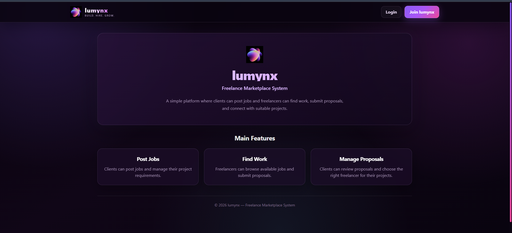

### Registration Page
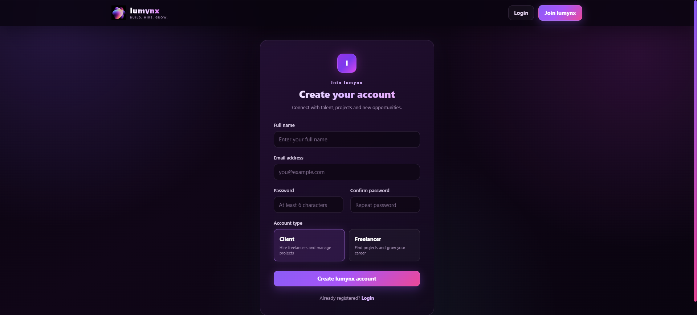

### Login Page
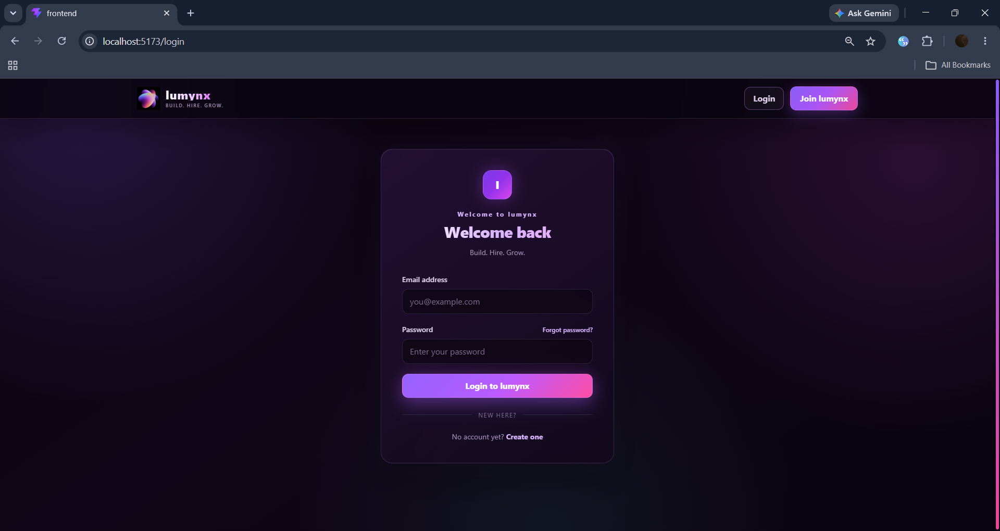

### Client Dashboard
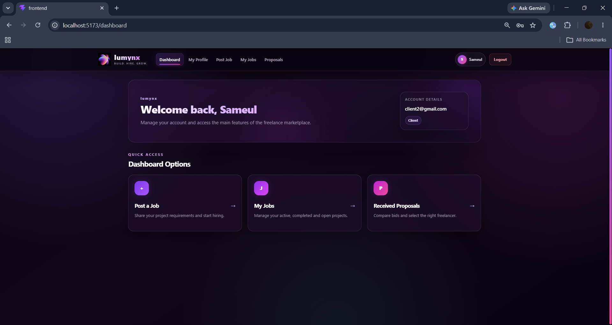

### Client Profile
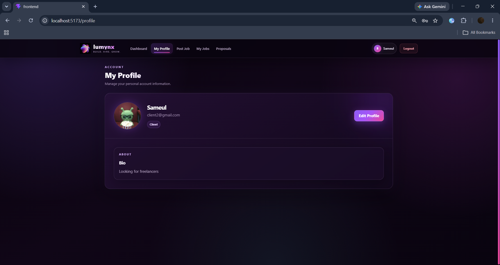

### Post Job
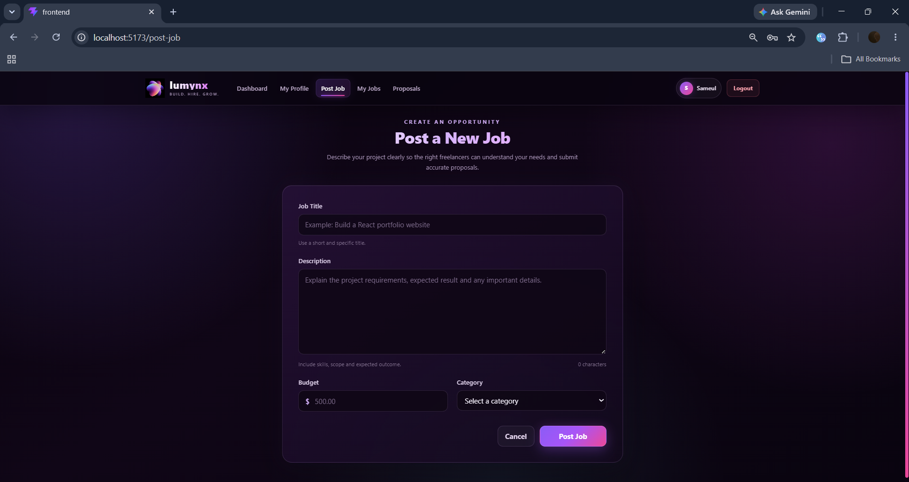

### My Jobs
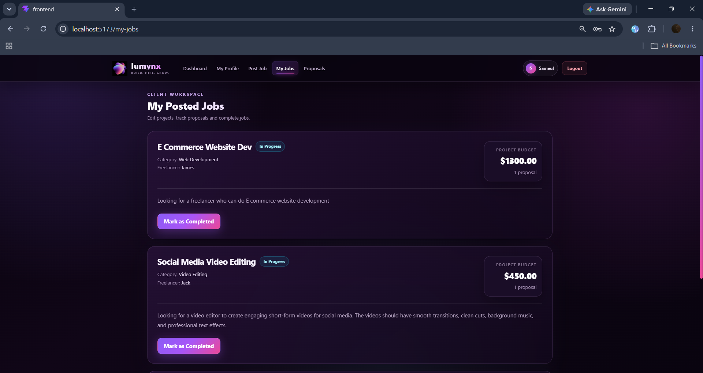

### Browse Jobs
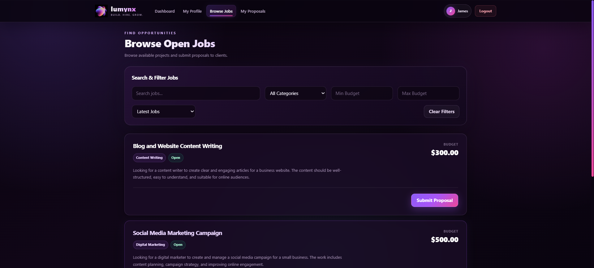

### Freelancer Dashboard
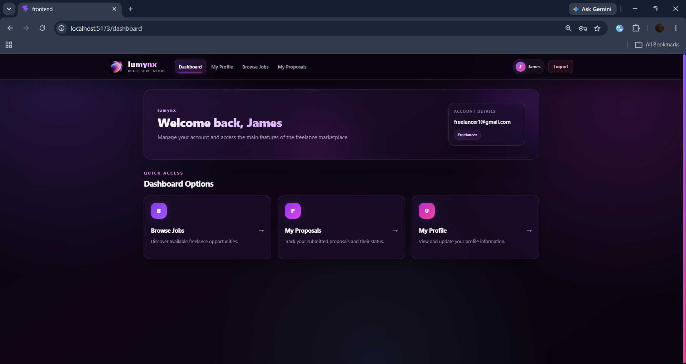

### Freelancer Profile
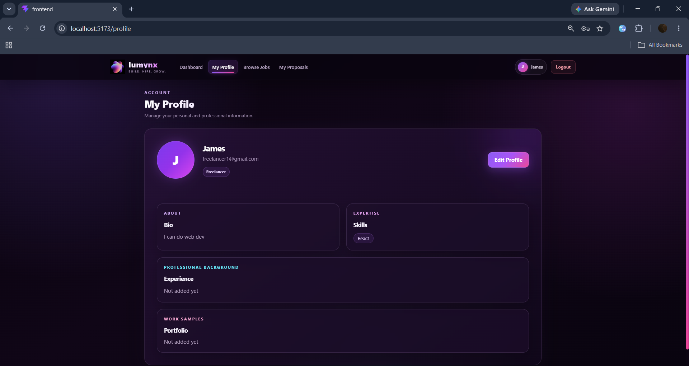

### Submit Proposal
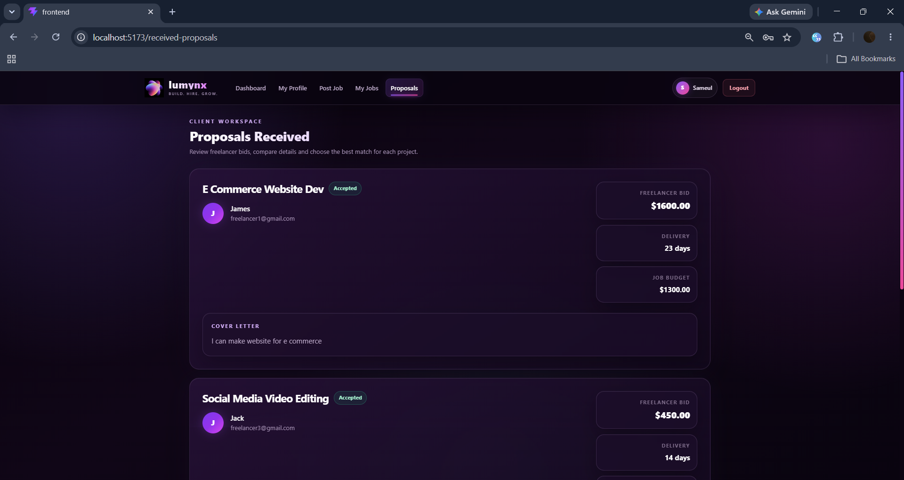

### My Proposals
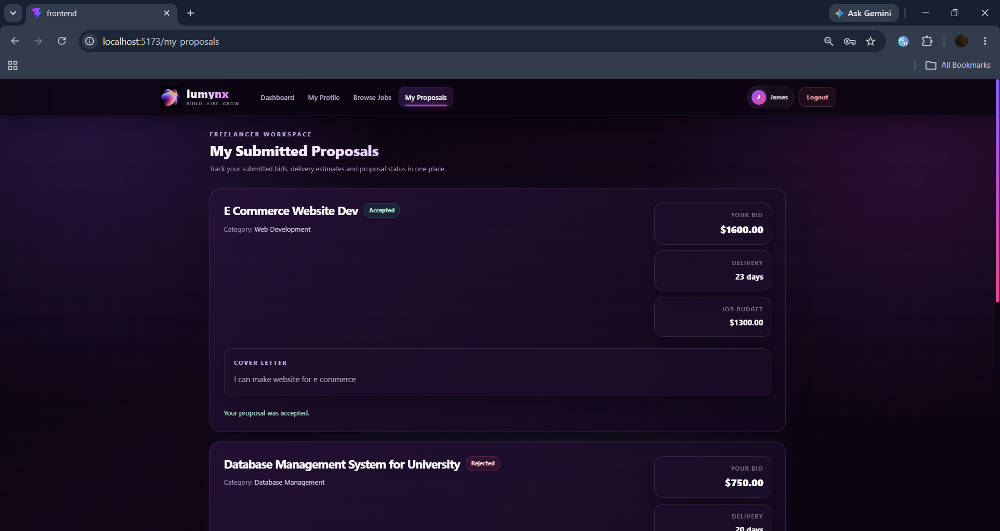

### Admin Dashboard
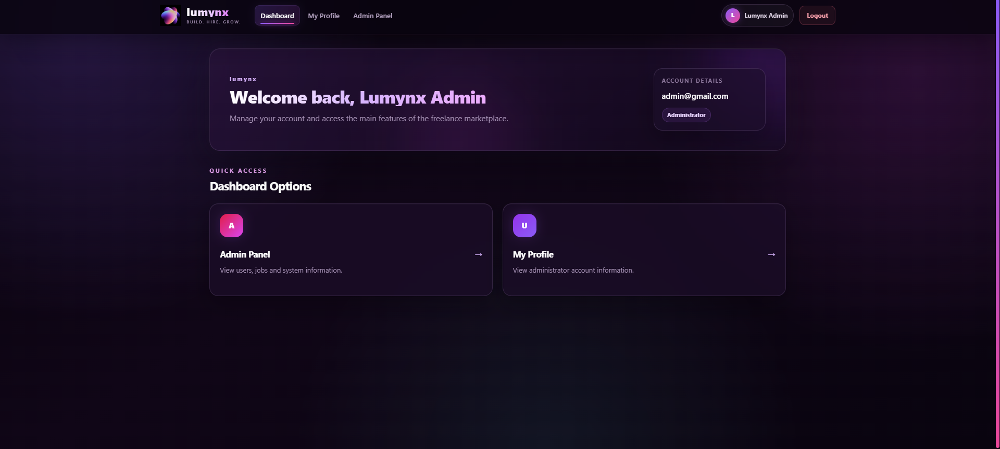

### Admin Statistics
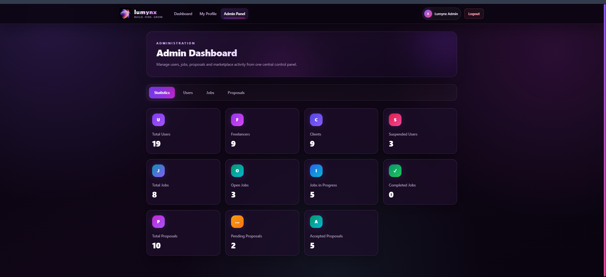

### Admin Users
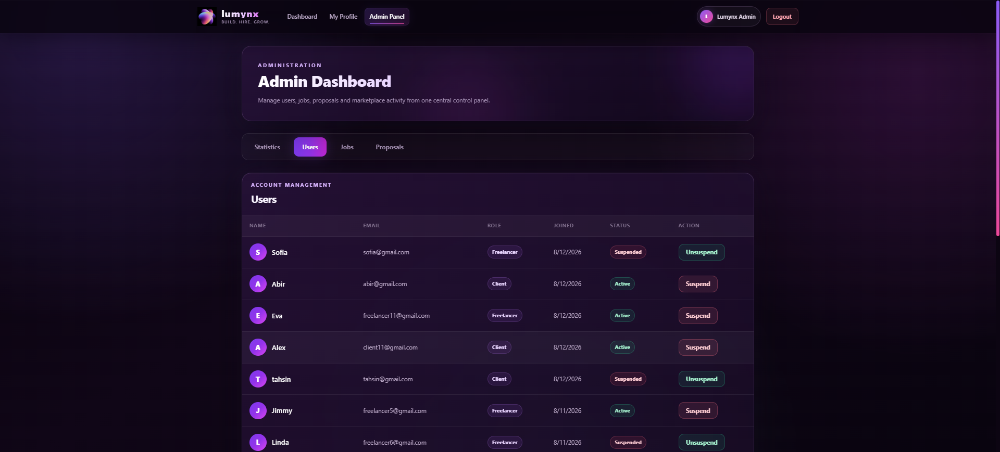

### Admin Jobs
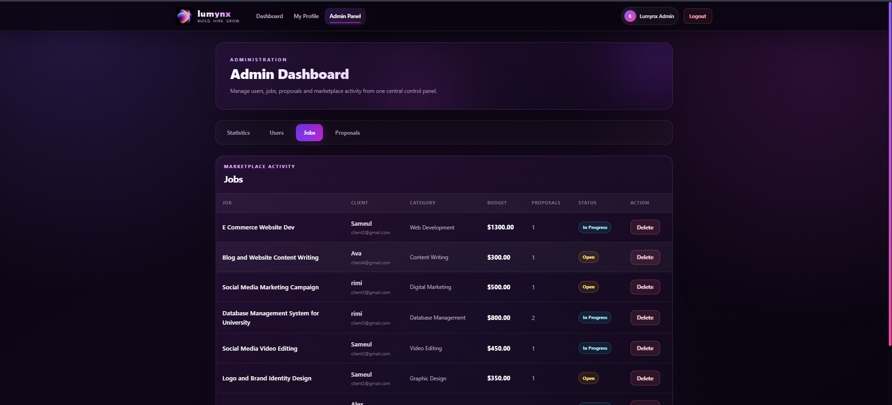

### Admin Proposals
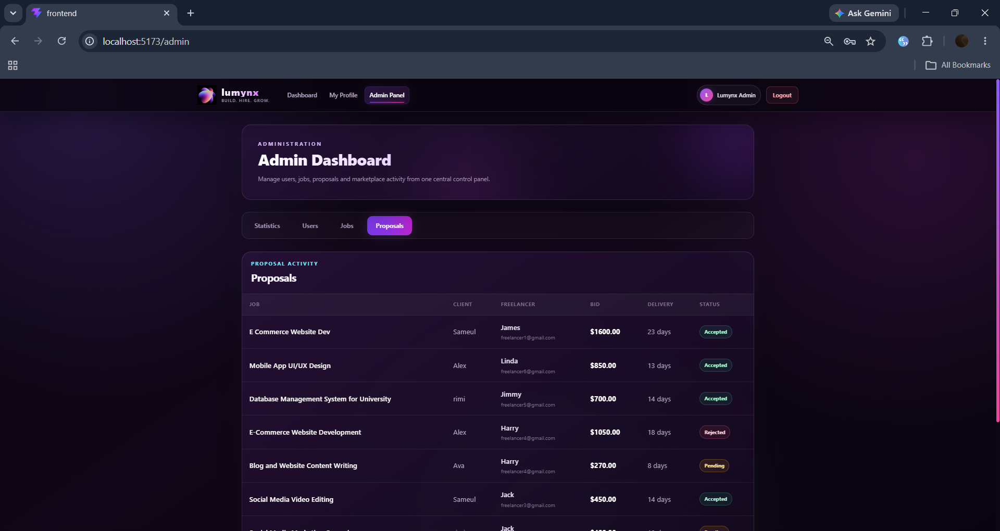

### Admin Profile
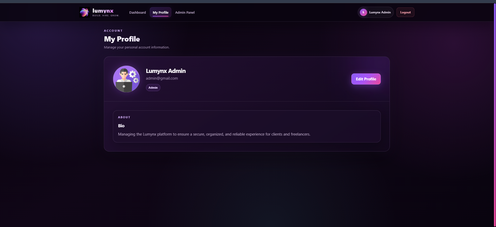

### 🔹 ER Diagram

ER Diagram was generated by MySQL Workbench 8.0 CE

🏗️ Tech Stack
Frontend

The frontend is developed using React.js with Vite and Tailwind CSS. It provides a responsive and role-based user interface for clients, freelancers, and administrators.

Backend

The backend is developed using Node.js and Express.js. REST APIs are used to handle authentication, user profiles, jobs, proposals, and administrative operations.

JWT (JSON Web Token) is used for authentication and protected routes.

Database

MySQL is used to store and manage the application data.

The main database tables are:

users
categories
jobs
proposals
password_reset_tokens

Primary keys and foreign keys are used to maintain relationships between users, jobs, categories, and proposals.

⚙️ Installation & Setup
1. Clone the Repository
git clone https://github.com/isratvx/freelance_marketplace_system_lumynx.git
2. Navigate to the Project Folder
cd freelance_marketplace_system_lumynx
3. Install Backend Dependencies
cd backend
npm install
4. Configure Environment Variables

Create a .env file inside the backend folder and configure the required database and authentication settings.

5. Start the Backend
npm run dev

The backend will run on:

http://localhost:5000
6. Install Frontend Dependencies

Open another terminal and run:

cd frontend
npm install
7. Start the Frontend
npm run dev

Open the local URL provided by Vite in your browser.

8. Database Setup

Import the provided MySQL database/schema using MySQL Workbench and make sure the database connection information matches the configuration in the backend .env file.

🗂️ Project Structure
/freelance_marketplace_system_lumynx
│
├── backend/
│   ├── config/
│   ├── middleware/
│   ├── routes/
│   ├── uploads/
│   └── server.js
│
├── database/
│   └── MySQL database files
│
├── docs/
│
├── ER Diagram/
│   └── ER diagram
│
├── frontend/
│   ├── public/
│   ├── src/
│   │   ├── assets/
│   │   ├── components/
│   │   └── pages/
│   └── package.json
│
├── screenshots/
│   ├── admin_dashboard.png
│   ├── admin_jobs.png
│   ├── admin_proposal.png
│   ├── admin_statistics.png
│   ├── admin_users.png
│   ├── adminprofile.png
│   ├── browse_jobs.png
│   ├── clientdashboard.png
│   ├── clientprofile.png
│   ├── freelancer_dashboard.png
│   ├── freelancer_profile.png
│   ├── home.png
│   ├── login.png
│   ├── myjob.png
│   ├── myproposals.png
│   ├── postjob.png
│   ├── proposals.png
│   └── registration.png
│
├── .gitignore
└── README.md

🔄 System Workflow

Client

Register/Login → Create Profile → Post Job → View Proposals → Accept/Reject Proposal → Job In Progress

Freelancer

Register/Login → Create Profile → Browse Jobs → Submit Proposal → Track Proposal Status

Admin

Login → View Statistics → Manage Users → Monitor Jobs → Monitor Proposals

🎥 Demo Video

👉 Watch Project Demo: [https://drive.google.com/file/d/1D9u8V8RXSwqXUNSBe1O1K-_UuoYL4sWd/view?usp=drive_link]

📌 Conclusion

LUMYNX demonstrates the core functionality of a freelance marketplace by connecting clients and freelancers through job postings and proposals. The system combines role-based access, job and proposal management, authentication, database relationships, and administrative control within a single web application.